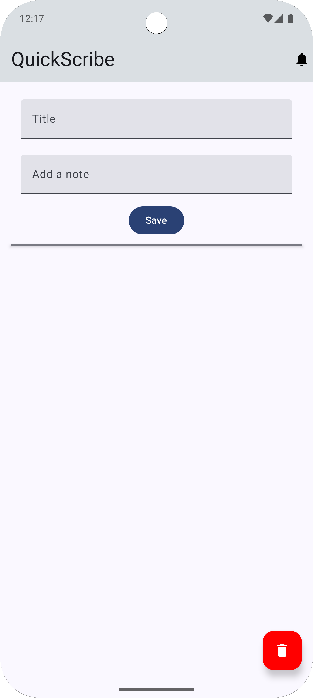

# 📝 QuickScribe - Note-Taking App

QuickScribe is a sleek and user-friendly Android app built using Kotlin and Jetpack Compose. It allows users to create, manage, and delete notes with ease. The app showcases modern Android development practices with a clean architecture, intuitive UI, and persistent local storage using Room Database.

---

## 🚀 Features

- **Create Notes**: Add new notes with a title and content.
- **View Notes**: Browse a list of saved notes with real-time updates.
- **Delete Notes**: Remove individual notes by tapping on them.
- **Delete All Notes**: Clear all notes with a single click on the Floating Action Button (FAB).
- **Real-Time UI Updates**: Built using Jetpack Compose with state management for a smooth experience.
- **Persistent Storage**: Notes are saved locally using Room Database, ensuring they persist across app sessions.

---

## 📸 Screenshots

### **Home Screen**


### **Creating a New Note**


### **List of Notes**


### **Deleting a Note**


### **Deleting All Notes**


---

## 🛠️ Tech Stack

- **Language**: Kotlin
- **UI Framework**: Jetpack Compose
- **Local Database**: Room Database
- **Dependency Injection**: Hilt
- **State Management**: StateFlow and MutableStateFlow
- **Material Design 3**: Modern UI components and theming

---

## 📂 Folder Structure

```plaintext
com.example.quickscribe
├── components          # Reusable Jetpack Compose components
├── data                # Room Database setup, DAOs, and mock data
├── di                  # Dependency Injection setup using Hilt
├── model               # Data classes like Note
├── repository          # Repository layer for data management
├── screen              # Composable screens and ViewModel
├── ui.theme            # Custom themes and color definitions
├── util                # Utility classes like DateConverter and UUIDConverter
└── MainActivity.kt     # Entry point for the app
```

## Clone the Repository
To get a local copy of the project up and running, clone the repository:
```bash
git clone https://github.com/MohammedYusuf-123/QuickScribe.git
cd quickscribe
```

---

## Contributions are welcome! Follow these steps to contribute:
	1.	Fork the Repository: Click the “Fork” button on GitHub.
	2.	Create a Branch: Create a new branch for your feature:
			git checkout -b feature/your-feature
	3.	Commit your changes and push to your fork:
			git commit -m "Add your message here"
			git push origin feature/your-feature
	4.	Open a pull request with a detailed description.

